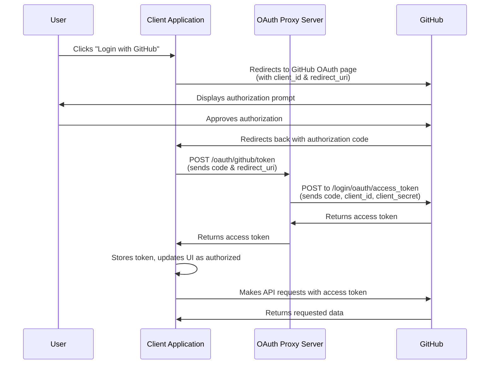

# GitHub OAuth Proxy Server

## Overview

This application serves as an authentication proxy for the [NSS Foundations Course](https://github.com/nashville-software-school/foundations-course) web application that needs to authenticate users with GitHub. It solves a critical security problem: client-side applications (like SPAs or static sites) cannot securely store OAuth client secrets, but these secrets are required to complete the OAuth flow with GitHub.

Key features:
- Securely handles the exchange of OAuth authorization codes for access tokens
- Provides CORS protection to ensure only authorized origins can make requests
- Runs behind Nginx for SSL termination and secure HTTPS connections
- Dockerized for easy deployment and scaling

## How It Works

When a user wants to authenticate with GitHub in your web application:

1. Your client app redirects the user to GitHub's OAuth authorization page
2. After the user authorizes your app, GitHub redirects back to your app with an authorization code
3. Your client app sends this code to this proxy server
4. The proxy server (which has the client secret) exchanges the code for an access token with GitHub
5. The proxy returns the access token to your client app
6. Your client app can now use this token to make authenticated API requests to GitHub

## Authentication Flow Diagram



## Docker Configuration Explained

The `Dockerfile` defines how the application is containerized. Here's a breakdown of what it does:

```dockerfile
# Stage 1: Build Node.js application
FROM node:18-alpine AS nodejs-build
```
This line starts with a lightweight Alpine Linux image that has Node.js 18 installed. The `AS nodejs-build` creates a named build stage that we can reference later.

```dockerfile
WORKDIR /app
COPY package*.json ./
RUN npm ci --only=production
COPY . .
```
These lines:
1. Set the working directory to `/app`
2. Copy the package.json and package-lock.json files
3. Install only the production dependencies (no dev dependencies)
4. Copy all other application files

```dockerfile
# Stage 2: Final image with Nginx and Node.js
FROM nginx:alpine
```
This starts a new stage using the Nginx Alpine image as the base.

```dockerfile
RUN apk add --no-cache nodejs npm openssl
```
This installs Node.js, npm, and OpenSSL into the Nginx image.

```dockerfile
WORKDIR /app
COPY --from=nodejs-build /app /app
```
These lines:
1. Set the working directory to `/app`
2. Copy the built application from the previous stage

```dockerfile
COPY nginx.conf /etc/nginx/conf.d/default.conf
```
This copies your Nginx configuration to where Nginx looks for site configurations.

```dockerfile
RUN mkdir -p /etc/nginx/ssl
COPY start.sh /start.sh
RUN chmod +x /start.sh
```
These lines:
1. Create a directory for SSL certificates
2. Copy the startup script
3. Make the startup script executable

```dockerfile
EXPOSE 80 443
CMD ["/start.sh"]
```
These lines:
1. Inform Docker that the container will use ports 80 (HTTP) and 443 (HTTPS)
2. Set the startup script as the default command when the container starts

## GitHub Workflow Explained

The `.github/workflows/auth-proxy.yml` file defines the CI/CD pipeline that automatically tests, builds, and deploys your application when changes are pushed to the main branch.

### Testing Phase

```yaml
test:
  runs-on: ubuntu-latest
  steps:
    - uses: actions/checkout@v3
    - name: Set up Node.js
      uses: actions/setup-node@v3
      with:
        node-version: '18'
        cache: 'npm'
    - name: Install dependencies
      run: npm ci
    - name: Run tests
      run: npm test
      continue-on-error: true
```

This job:
1. Runs on an Ubuntu virtual machine
2. Checks out your code
3. Sets up Node.js version 18 with npm caching
4. Installs dependencies
5. Runs tests (allows continuing even if tests fail, since they might not be implemented yet)

### Build and Push Phase

```yaml
build-and-push:
  needs: test
  runs-on: ubuntu-latest
  steps:
    # ... setup steps ...
    - name: Build and push Docker image
      uses: docker/build-push-action@v4
      with:
        context: .
        push: true
        tags: |
          ghcr.io/${{ github.repository_owner }}/auth-proxy:latest
          ghcr.io/${{ github.repository_owner }}/auth-proxy:${{ github.sha }}
```

This job:
1. Only runs after the test job completes
2. Builds the Docker image using your Dockerfile
3. Pushes the image to GitHub Container Registry with two tags:
   - 'latest': Always points to the most recent successful build
   - A tag using the commit SHA for versioning and rollback capability

### Deployment Phase

The deployment section is more complex:

```yaml
deploy:
  needs: build-and-push
  runs-on: ubuntu-latest
  steps:
    # ... setup steps ...
    - name: Create deployment directory and files on droplet
      uses: appleboy/ssh-action@master
      with:
        host: authproxy.nss.team
        username: root
        key: ${{ secrets.SSH_PRIVATE_KEY }}
        script: |
          mkdir -p /opt/authproxy
```

This creates a directory on the server if it doesn't already exist.

```yaml
- name: Deploy to Digital Ocean droplet
  uses: appleboy/ssh-action@master
  with:
    host: authproxy.nss.team
    username: root
    key: ${{ secrets.SSH_PRIVATE_KEY }}
    script: |
      cd /opt/authproxy

      # Create or update .env file
      cat > .env << EOF
      PORT=3000
      OAUTH_CLIENT_ID=${{ secrets.OAUTH_CLIENT_ID }}
      OAUTH_CLIENT_SECRET=${{ secrets.OAUTH_CLIENT_SECRET }}
      ALLOWED_ORIGINS=https://nashville-software-school.github.io
      NODE_ENV=production
      EOF
```

This:
1. Connects to your DigitalOcean server using SSH
2. Changes to the application directory
3. Creates an environment file (.env) with sensitive configuration values pulled from GitHub repository secrets

```yaml
# Create or update docker-compose.yml
cat > docker-compose.yml << EOF
services:
  authproxy:
    image: ghcr.io/${{ github.repository_owner }}/auth-proxy:${{ github.sha }}
    ports:
      - "80:80"
      - "443:443"
    env_file:
      - .env
    volumes:
      - /etc/letsencrypt/live/authproxy.nss.team/fullchain.pem:/etc/ssl/certs/authproxy.fullchain.pem:ro
      - /etc/letsencrypt/live/authproxy.nss.team/privkey.pem:/etc/ssl/private/authproxy.privkey.pem:ro
    restart: unless-stopped
EOF
```

This creates a Docker Compose file that:
1. Uses the image built in the previous step
2. Maps ports 80 and 443 from the host to the container
3. Uses the environment variables from the .env file
4. Mounts SSL certificates from Let's Encrypt into the container
5. Configures the container to restart automatically unless explicitly stopped

```yaml
# Log into GitHub Container Registry
echo ${{ secrets.GH_TOKEN }} | docker login ghcr.io -u ${{ github.repository_owner }} --password-stdin

# Deploy
docker compose pull
docker compose up -d

# Clean up old images
docker image prune -f
```

These final commands:
1. Log into GitHub Container Registry to pull the private image
2. Pull the latest image
3. Start or update the container in detached mode (-d)
4. Clean up old, unused Docker images to free up disk space

## Running Your Own Instance

If you want to run your own instance of this proxy:

1. **Create a GitHub OAuth App**:
   - Go to GitHub > Settings > Developer Settings > OAuth Apps > New OAuth App
   - Set the Authorization callback URL to your client application's URL
   - Note your Client ID and Client Secret

2. **Clone this repository**:
   ```
   git clone <repository-url>
   cd <repository-directory>
   ```

3. **Create a .env file**:
   ```
   PORT=3000
   OAUTH_CLIENT_ID=your_github_client_id
   OAUTH_CLIENT_SECRET=your_github_client_secret
   ALLOWED_ORIGINS=https://your-frontend-app.com,http://localhost:3000
   ```

4. **Install dependencies**:
   ```
   npm install
   ```

5. **Run the application**:

   For development with auto-restart on file changes:
   ```
   npm run dev
   ```

6. **Verify the server is running**:
   - The server will output: `OAuth proxy server running on port 3000` (or your configured port)
   - You can test the health endpoint by visiting: `http://localhost:3000/health`

## Contributing

Contributions are welcome! Here's how you can contribute:

1. Fork the repository
2. Create a feature branch: `git checkout -b my-new-feature`
3. Make your changes
4. Run tests: `npm test`
5. Commit your changes: `git commit -am 'Add some feature'`
6. Push to the branch: `git push origin my-new-feature`
7. Submit a pull request

## Troubleshooting

If you encounter issues with Nginx configuration, check for syntax errors with:
```
docker exec <container-id> nginx -t
```

To view logs:
```
docker logs <container-id>
```

## License

This project is licensed under the MIT License - see the LICENSE file for details.