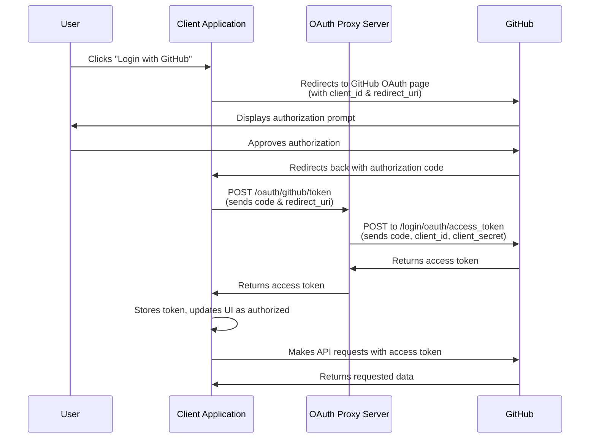

# GitHub OAuth Proxy Server

## Overview

This proxy lets client-side applications (SPAs, static sites) complete the GitHub OAuth flow without exposing OAuth secrets in the browser. It runs as an AWS Lambda function behind API Gateway — cost is effectively $0 at low traffic volumes (Lambda free tier: 1M requests/month).

It supports **multiple sites** from a single deployment. Each request identifies itself with an `X-Site-ID` header, and the proxy uses the corresponding OAuth credentials.

## How It Works

```
Client App  →  POST /oauth/github/token  →  Proxy Lambda  →  GitHub
               (with X-Site-ID header)       (adds client secret)

When a user wants to authenticate with GitHub in your web application:

1. Your client app redirects the user to GitHub's OAuth authorization page
2. After the user authorizes your app, GitHub redirects back to your app with an authorization code
3. Your client app sends this code to this proxy server
4. The proxy server (which has the client secret) exchanges the code for an access token with GitHub
5. The proxy returns the access token to your client app
6. Your client app can now use this token to make authenticated API requests to GitHub

## Secrets Needed

Look in the `auth-proxy.yml` file to see all of the Github Action secrets needed.

Current list of allowed origins. Update this is there's any domain in the future that will use the auth proxy.

1. https://nashville-software-school.github.io
2. https://nss-workshops.github.io

## Authentication Flow Diagram


```mermaid
sequenceDiagram
    participant User
    participant ClientApp as Client Application
    participant Proxy as OAuth Proxy Server
    participant GitHub

    User->>ClientApp: Clicks "Login with GitHub"
    ClientApp->>GitHub: Redirects to GitHub OAuth page<br/>(with client_id & redirect_uri)
    GitHub->>User: Displays authorization prompt
    User->>GitHub: Approves authorization
    GitHub->>ClientApp: Redirects back with authorization code

    ClientApp->>Proxy: POST /oauth/github/token<br/>(sends code & redirect_uri)
    Proxy->>GitHub: POST to /login/oauth/access_token<br/>(sends code, client_id, client_secret)
    GitHub->>Proxy: Returns access token
    Proxy->>ClientApp: Returns access token

    ClientApp->>ClientApp: Stores token, updates UI as authorized
    ClientApp->>GitHub: Makes API requests with access token
    GitHub->>ClientApp: Returns requested data
```

1. User clicks "Login with GitHub" in your app
2. GitHub redirects back with an authorization `code`
3. Your app POSTs the code to this proxy with the `X-Site-ID` header
4. The proxy exchanges the code for a token using the matching client secret
5. The proxy returns the access token to your app

## Multi-Site Configuration

Site configuration lives in two places:

### 1. `sites.json` (committed to this repo — no secrets)

Controls which origins are allowed per site:

```json
{
  "foundations": {
    "description": "NSS Foundations Course",
    "allowedOrigins": [
      "https://nashville-software-school.github.io",
      "http://localhost:5173"
    ]
  },
  "another-site": {
    "description": "Some Other Course",
    "allowedOrigins": [
      "https://example.github.io"
    ]
  }
}
```

### 2. OAuth credentials (stored in AWS Secrets Manager)

Credentials live in a single secret named `nss-auth-proxy/sites-secrets` in us-east-2. The Lambda fetches this at cold start — no secrets ever touch environment variables or deploy commands.

Secret format (JSON string):

```json
{
  "foundations": {
    "clientId": "Ov23liob4W4lgVj20u3z",
    "clientSecret": "d17f5881..."
  },
  "another-site": {
    "clientId": "Ov23li...",
    "clientSecret": "abc123..."
  }
}
```

See [Managing Secrets](#managing-secrets) below for the CLI commands to create and update this secret.

---

## Adding a New Site
For these steps, you'll need the private SSH key that is used for the **root** account on the VPS as a repo secret named `SSH_PRIVATE_KEY`. Right now, this is coupled to a Digital Ocean droplet so if you want to deploy to AWS or other cloud provider, this particular action would need to be swapped out.

The deployment section is more complex:

1. **Create a GitHub OAuth App**
   - GitHub → Settings → Developer Settings → OAuth Apps → New OAuth App
   - Set Authorization callback URL to your client app's URL
   - Copy the Client ID and Client Secret

2. **Add the site to `sites.json`** and commit:
   ```json
   "my-new-site": {
     "description": "My New Course",
     "allowedOrigins": ["https://my-org.github.io", "http://localhost:5173"]
   }
   ```

3. **Update the secret in Secrets Manager** — see [Managing Secrets](#managing-secrets) below.

4. **Deploy** — `sam build && sam deploy --profile Workshops_Serverless`

5. **Update your client app** to send the header:
   ```js
   fetch('https://<api-gateway-url>/oauth/github/token', {
     method: 'POST',
     headers: {
       'Content-Type': 'application/json',
       'X-Site-ID': 'my-new-site'
     },
     body: JSON.stringify({ code, redirect_uri })
   })
   ```

---

## AWS Deployment

This service is deployed to AWS Lambda (profile `Workshops_Serverless`, region `us-east-2`).

### Prerequisites

- **AWS CLI** with SSO configured: `brew install awscli` then `aws configure sso --profile Workshops_Serverless`
- **AWS SAM CLI**: `brew install aws-sam-cli`

### First Deploy (one-time setup)

Create the secret first (see [Managing Secrets](#managing-secrets)), then:

```bash
aws sso login --profile Workshops_Serverless
npm ci --only=production
sam build
sam deploy --guided --profile Workshops_Serverless
```

When prompted:
- **Stack name**: `nss-auth-proxy`
- **Region**: `us-east-2`
- Accept defaults for everything else

After this runs, `samconfig.toml` saves the stack name and region so you don't have to re-enter them.

### Subsequent Deploys

```bash
aws sso login --profile Workshops_Serverless
npm ci --only=production
sam build
sam deploy --profile Workshops_Serverless
```

The API Gateway URL is printed in the deploy output under `ApiUrl`. Use that URL in your client apps.

---

## Managing Secrets

Credentials are stored in AWS Secrets Manager under the name `nss-auth-proxy/sites-secrets`.

### Create the secret (first time)

```bash
aws sso login --profile Workshops_Serverless

aws secretsmanager create-secret \
  --name nss-auth-proxy/sites-secrets \
  --description "GitHub OAuth credentials for NSS auth proxy sites" \
  --secret-string '{"foundations":{"clientId":"YOUR_ID","clientSecret":"YOUR_SECRET"}}' \
  --profile Workshops_Serverless \
  --region us-east-2
```

### Update existing credentials (add a site or rotate a secret)

Fetch the current value, edit it, then push it back:

```bash
aws sso login --profile Workshops_Serverless

# View current secret
aws secretsmanager get-secret-value \
  --secret-id nss-auth-proxy/sites-secrets \
  --profile Workshops_Serverless \
  --region us-east-2 \
  --query SecretString \
  --output text

# Push updated value
aws secretsmanager update-secret \
  --secret-id nss-auth-proxy/sites-secrets \
  --secret-string '{"foundations":{"clientId":"...","clientSecret":"..."},"new-site":{"clientId":"...","clientSecret":"..."}}' \
  --profile Workshops_Serverless \
  --region us-east-2
```

The Lambda picks up the new value on its next cold start. To force an immediate refresh, touch the function config:

```bash
aws lambda update-function-configuration \
  --function-name nss-auth-proxy \
  --description "force cold start $(date -u +%Y-%m-%dT%H:%M:%SZ)" \
  --profile Workshops_Serverless \
  --region us-east-2
```

---

## Local Development

```bash
cp .env.example .env
# Edit .env and fill in SITES_SECRETS for local testing
npm install
npm start
```

`.env` for local dev (never commit real secrets):

```
PORT=3000
# Plain JSON (not base64) works locally
SITES_SECRETS={"foundations":{"clientId":"YOUR_ID","clientSecret":"YOUR_SECRET"}}
```

Test the health endpoint:
```
GET http://localhost:3000/health
```

---

## Troubleshooting

**`Unknown site` error** — the `X-Site-ID` header value doesn't match any key in `sites.json`. Check spelling and that the site has been added.

**`Credentials not configured` error** — the site is in `sites.json` but missing from the `SITES_SECRETS` GitHub secret. Update the secret and redeploy.

**CORS error** — the requesting origin isn't in `allowedOrigins` for that site in `sites.json`. Add it and redeploy.

**View Lambda logs:**
```bash
aws logs tail /aws/lambda/nss-auth-proxy --follow --profile Workshops_Serverless
```
